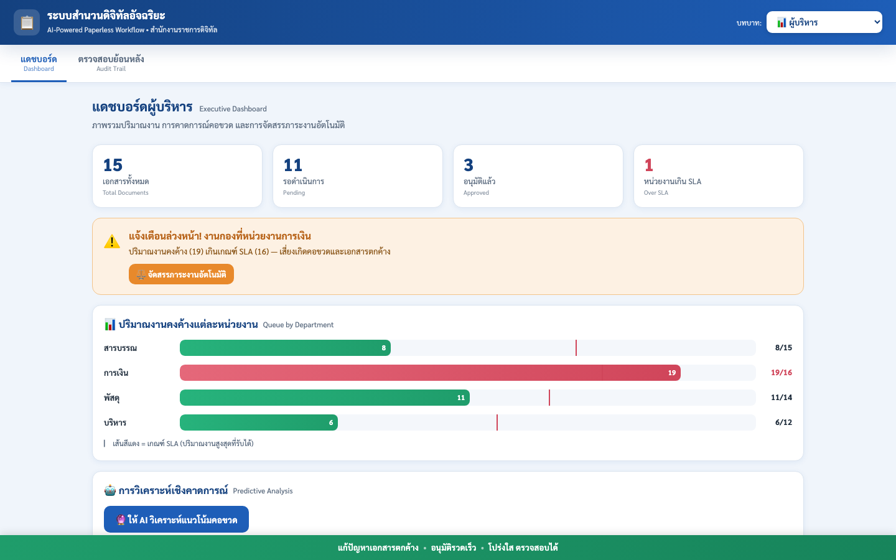

# ระบบสำนวนดิจิทัลอัจฉริยะ (AI-Powered Paperless Workflow)

Proof-of-concept แบบ single-file HTML/CSS/JS จำลองระบบเวียนเอกสารดิจิทัลของหน่วยงานราชการ ตั้งแต่การสร้างเอกสาร ลงลายมือชื่อดิจิทัล เวียนอนุมัติ ไปจนถึงแดชบอร์ดสำหรับผู้บริหารและการตรวจสอบย้อนหลัง ทุกอย่างรันในเบราว์เซอร์โดยไม่ต้องมี backend (ข้อมูลเป็น mock data ในหน้าเว็บ)

## ตัวอย่างหน้าจอ (Screenshot)



## ฟีเจอร์หลัก

- **สร้างเอกสาร (Create)** — เลือกแม่แบบเอกสาร (บันทึกข้อความ / ใบขออนุมัติจัดซื้อ / ใบลา) กรอกรายละเอียด แล้วลงลายมือชื่อดิจิทัลด้วยใบรับรองอิเล็กทรอนิกส์จำลอง (SHA-256 fingerprint)
- **เอกสารของฉัน (My Documents)** — ติดตามสถานะและเส้นทางการเวียนเอกสารที่สร้างไว้
- **กล่องรออนุมัติ (Approval Inbox)** — สำหรับผู้อนุมัติ พร้อมผู้ช่วย AI ที่ตรวจสอบความครบถ้วน สรุปเอกสาร และเสนอ **อนุมัติอัตโนมัติ (Straight-Through Processing)** สำหรับรายการที่เข้าเกณฑ์
- **แดชบอร์ดผู้บริหาร (Executive Dashboard)** — ภาพรวมปริมาณงานคงค้างแต่ละหน่วยงานเทียบกับเกณฑ์ SLA พร้อมการวิเคราะห์เชิงคาดการณ์คอขวด
- **ตรวจสอบย้อนหลัง (Audit Trail)** — ประวัติการดำเนินการทั้งหมดของทุกเอกสาร โปร่งใสและตรวจสอบได้
- รองรับ 3 บทบาท: เจ้าหน้าที่สร้างเอกสาร, ผู้อนุมัติ, ผู้บริหาร

## วิธีใช้งาน

เปิดไฟล์ [`paperless-workflow.html`](paperless-workflow.html) ด้วยเบราว์เซอร์โดยตรง หรือรันเซิร์ฟเวอร์ static ง่าย ๆ:

```bash
python3 -m http.server 8000
```

แล้วเปิด `http://localhost:8000/paperless-workflow.html`

ลายมือชื่อดิจิทัลใช้ Web Crypto (`crypto.subtle`) ซึ่งเบราว์เซอร์เปิดให้ใช้เฉพาะ `file://`, `localhost` และ `https://`

## กติกาที่ระบบใช้

- **อนุมัติอัตโนมัติ (STP)** ได้เฉพาะใบขออนุมัติจัดซื้อ วงเงิน 1–49,999 บาท ที่ผ่านทุกข้อตรวจ ใบลาและบันทึกข้อความต้องให้ผู้มีอำนาจอนุมัติเสมอ
- **ลายมือชื่อดิจิทัล** คือ SHA-256 ของเนื้อหาเอกสาร (ประเภท ชื่อเรื่อง หน่วยงาน วงเงิน ความเร่งด่วน รายละเอียด ผู้ลงนาม เวลาลงนาม) ลงนามแล้วฟอร์มจะถูกล็อก และหน้ารายละเอียดมีปุ่มตรวจว่าเนื้อหายังตรงกับที่ลงนาม
- **วงเงิน** ต้องไม่ติดลบ และใบขออนุมัติจัดซื้อต้องมากกว่า 0 บาท

## ทดสอบ

```bash
npm install
npm test
```

เปิดหน้าเว็บจริงใน [jsdom](https://github.com/jsdom/jsdom) แล้วเดินทุก flow ตั้งแต่สร้างเอกสารจนอนุมัติหรือตีกลับ ใช้เวลาราว 30 วินาที เพราะรอการลงนามและแผง AI ตามเวลาจริง

## เทคโนโลยี

HTML, CSS, Vanilla JavaScript — ตัวแอปไม่มี dependency ภายนอก (jsdom ใช้เฉพาะตอนทดสอบ), ข้อมูลทั้งหมดเป็น mock data ฝังอยู่ในไฟล์เดียว และคำตอบของ "AI" เป็นข้อความที่เขียนไว้ล่วงหน้า ไม่ได้เรียกโมเดลจริง
